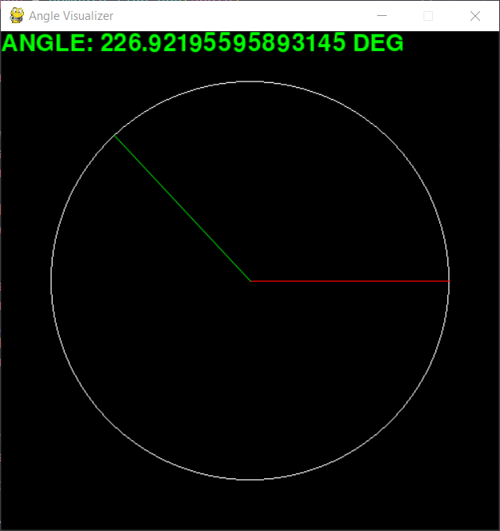

# ANGLE VISUALIZER
a small project that displays the angle of two points to the user.

### How to use
Just click anywhere inside the window. The program will calculate the angle based on the x and y coordinate of the mouse and the 0 degree coordinate (red line).

### Screenshots
  

  

  

  

### Purpose of the project 
Just a fun project